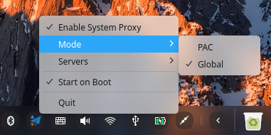

<p align="center"><a href="https://github.com/lolimay/shadowsocks-deepin" target="_blank" rel="noopener noreferrer"></a></p><p align="center">
  <a href="https://github.com/lolimay/shadowsocks-deepin"></a>
  <a href="https://github.com/lolimay/shadowsocks-deepin"></a>
  <a href="https://github.com/lolimay/shadowsocks-deepin"></a>
</p>

<h2 align="center">Shadowsocks for Deepin</h2>

**<p align="center">English | <a href="./docs/README_CN.md">中文</a></p>**

Shadowsocks-deepin is a powerful shadowsocks client for linux deepin.




Advantages compared to Shadowsocks-Qt5

|Software|Agent Mode|Accessibility|
|:-:|:-:|:-:|
|Shadowsocks-Qt5|only support global mode|need to manually configure system proxy or use Chrome extension|
|Shadowsocks-Deepin|both global mode and pac mode supported|no extra configuration required

# Installation
<br>
<p align="center"><a href="http://file.lolimay.cn/shadowsocks-deepin_1.2.2_amd64.deb"></a></p>

Shadowsocks-deepin is ready to use right out of box, as long as the right server configration was added and proper proxy mode selected, it should works well. **no extra system proxy configuration required, the software will done this for you**.
Any problems encounted during the use, please feel free to propose [**issues**](https://github.com/loliMay/shadowsocks-deepin/issues/new) to help us improve this project.

You can also try to package the source code yourself. The packing method is given below:
````bash
sudo apt update # update source
sudo apt install git dh-make cmake fakeroot qtcreator-dde qttools5-dev g++ -y #install dependencies
mkdir shadowsocks && cd shadowsocks # create shadowsocks folder and switch to this path
git clone git@github.com:loliMay/shadowsocks-deepin.git # clone shadowsocks-deepin repo
mv shadowsocks-deepin shadowsocks-deepin-1.2.2 #rename
tar -zcvf shadowsocks-deepin-1.2.2.tar.gz shadowsocks-deepin-1.2.2 # package to *.tar.gz
cd shadowsocks-deepin-1.2.2 # switch to the project root directory
dpkg-buildpackage -us -uc -b # package
````

Right click and select `opens in the file manager`, the `*.deb` file will appear in the `shadowsocks` directory.

# Terminal Proxy
Terminal cannot access target url through shadowsocks proxy by default either appling global mode or pac mode. [Proxychains](https://github.com/haad/proxychains) is a tool that forces any TCP connection to follow through shadowsocks proxy. Follow below steps and make any terminal commands access network through shadowsocks proxy:
1. `sudo apt install proxychains -y # insall proxychains`
2. `echo -e "[ProxyList]\nsocks5 127.0.0.1 1080" | tee ~/.proxychains/proxychains.conf # configration`
3. Prefix `proxychains` for any commands which you want it to access network through proxy.

Example:
````bash
npm install chalk # no proxy
proxychains npm install chalk # using socks5 proxy via proxychains
proxychains git clone git@github.com:lolimay/shadowsocks-deepin.git # using proxy
````


# Development

You can make contributions by participating in development. Start with the following steps:

````
sudo apt update
sudo apt install qt5-default qttools5-dev-tools qt5-qmake g++ qtcreator qttools5-dev -y
sudo apt install libdtkbase-dev libdtkwidget-dev -y
sudo apt install libdframeworkdbus-dev -y
sudo apt install libqrencode-dev libzbar-dev -y
sudo apt install libdtkcore-dev libdtkwidget-dev libdtkwm-dev libdtkcore-bin -y
sudo apt install libdtksettings-dev libdtksettingsview-dev -y
sudo apt install libqtshadowsocks-dev -y
sudo apt install dh-make fakeroot -y
cd shadowsocks-deepin
mkdir build && cd build
cmake ..
make -j4
cd src
./shadowsocks-deepin
````
# Update Logs
> 1.2.2 Fixes [#9](https://github.com/lolimay/shadowsocks-deepin/issues/9), complete chinese localization for main interface, change the traffic icon to [shadowsocks-windows](https://github.com/shadowsocks/shadowsocks-windows) style.
>
> 1.2.1 Fixes the bug that the pac mode cannot be used due to the invalidation of the original pac file online address. The latest pac file address is http://file.lolimay.cn/autoproxy.pac.
>
> 1.2.0 The main functions are almost all implemented.

# About this project
The initiator of this project is **[@PikachuHy](https://github.com/PikachuHy)**. Remember that without his hard work, we cannot use shadowsocks which is almost the same experience as it on windows. After the version 1.2.2, this project was maintained by [@LoliMay](https://github.com/lolimay).

# Licence

Shadowsocks-deepin is under [GPLv3](LICENSE) licence.

Appreciation to the following open source projects:

- [Deepin System Monitor](https://github.com/linuxdeepin/deepin-system-monitor)
- [Shadowsocks for Windows](https://github.com/shadowsocks/shadowsocks-windows)
- [libQtShadowsocks](https://github.com/shadowsocks/libQtShadowsocks)

## Dependencies

| Name                   | License        |
| ---------------------- | -------------- |
| [Deepin Tool Kit Core](https://github.com/linuxdeepin/dtkcore)   | GPLv3          |
| [Deepin Tool Kit Widget](https://github.com/linuxdeepin/dtkwidget) | GPLv3          |
| [Botan](https://github.com/randombit/botanss)                  | Simplified BSD |
| [libQtShadowsocks](https://github.com/shadowsocks/libQtShadowsocks)       | LGPLv3   |
| [ZBar](https://github.com/ZBar/ZBar)                   | LGPLv2.1       |
| [libqrencode](https://github.com/fukuchi/libqrencode)            | LGPLv2.1       |


